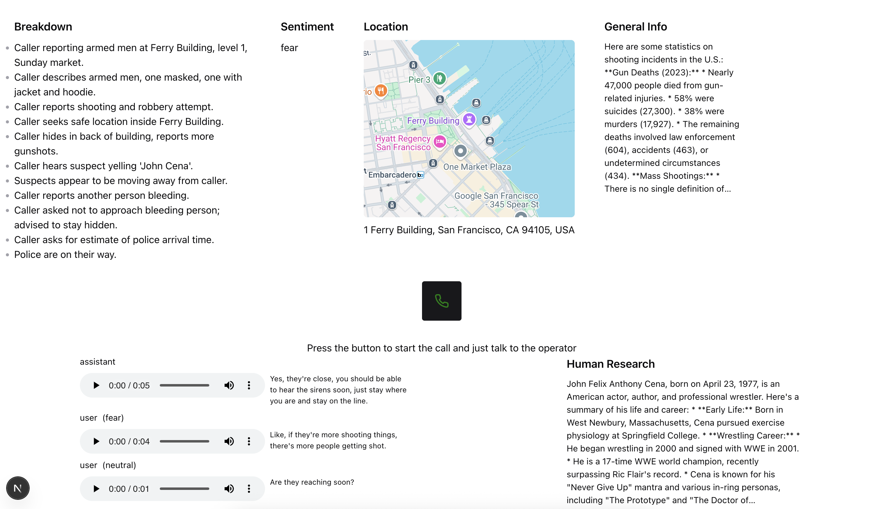

# 911 AI Operator Dashboard

The goal of this project is to build a speech-to-speech AI operator dashboard for the 911 system. As the user speaks and provides more information, AI operator builds a detailed overview and dashboard of this situation. Making it easier to track evidence and make decisions.

Usable demo: https://911-liart.vercel.app
Demo video: https://drive.google.com/file/d/1unI0GfoLh9FQroPpxGrnGsiFzNFQK7QC/view?usp=sharing

# Goals we tried to achieve

- Solve the man power problem on the dispatch center.
- Solve human error on high pressure situations.
- Maintain evidence and data for the police report.
- Make each component replaceable or with a local alternative. So we aren't locked into using one service provider.
- Make the dashboard generative and dynamic. Allowing the operator to ask follow up questions.

# Tech Used

- NextJS
- Groq
- JigsawStack
- OpenAI
- Anthropic (optional, doesn't work well client side)

# How to run

1. Clone the repository
2. Add .env keys
3. Run `yarn`
4. Run `yarn dev`

Research references:

- https://thecurrentga.org/2023/09/20/911-call-takers-are-demoralized-overwhelmed-and-dealing-with-their-own-mental-health-woes/
- https://www.npr.org/2024/04/05/1242310330/911-call-takers-police-alternative
- https://abcnews.go.com/US/difference-life-death-inside-staffing-crisis-911-dispatch/story?id=101082803
